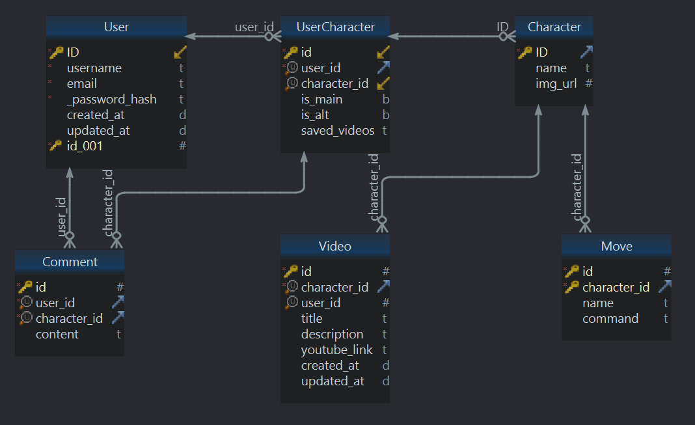
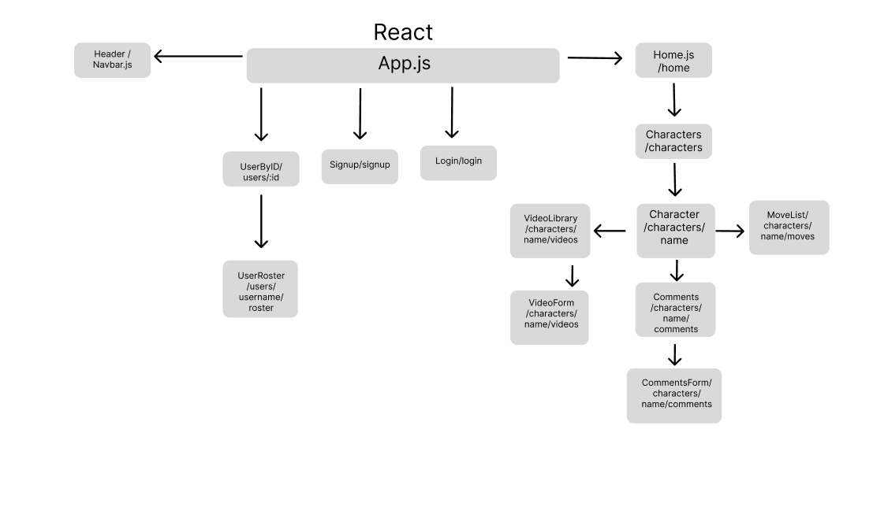
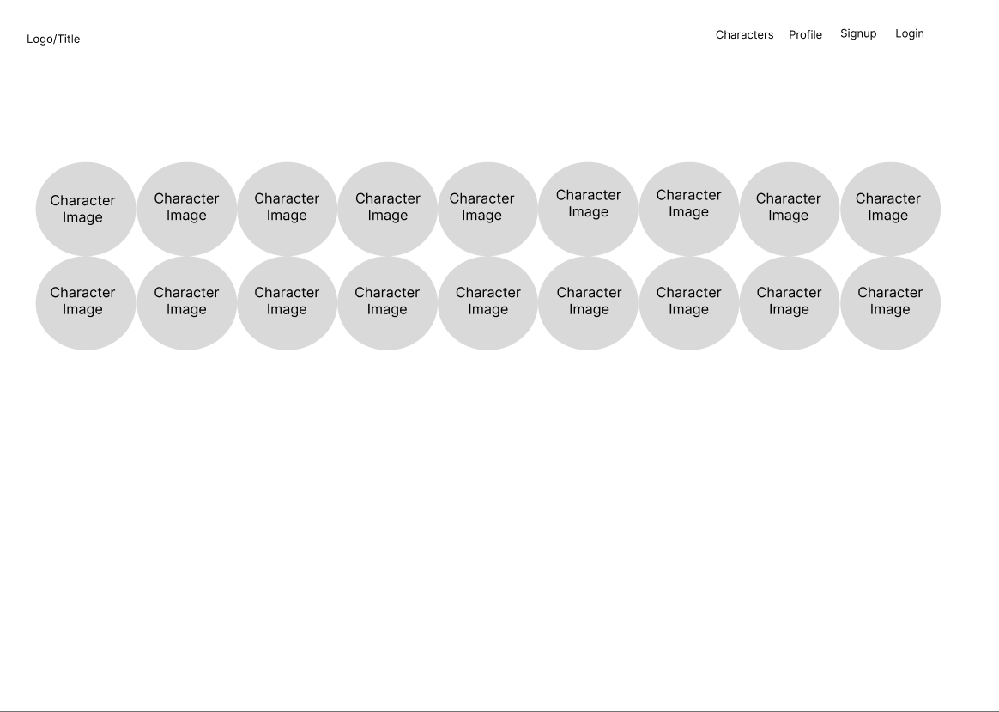
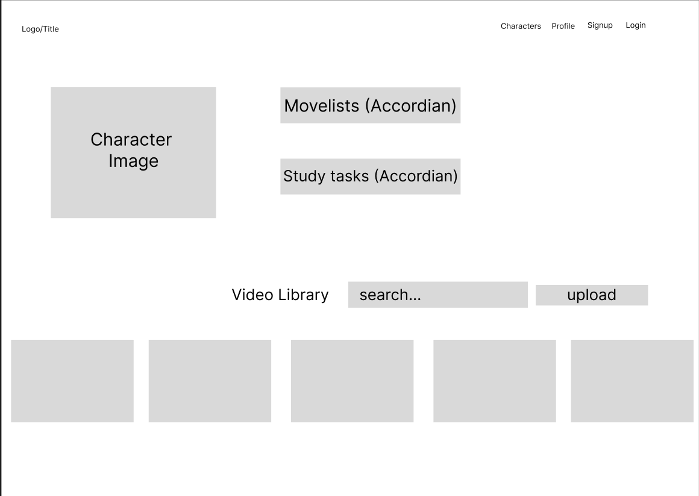
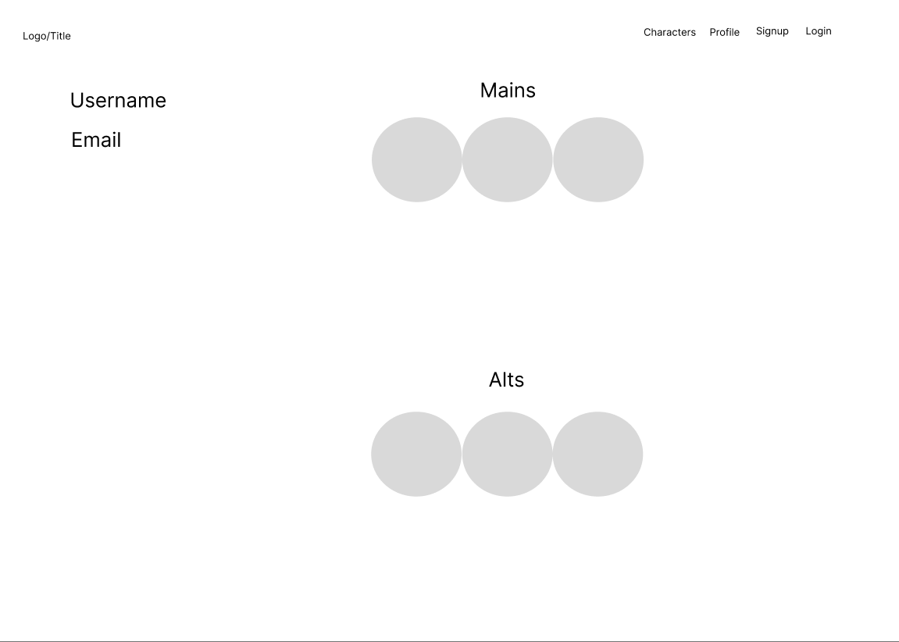
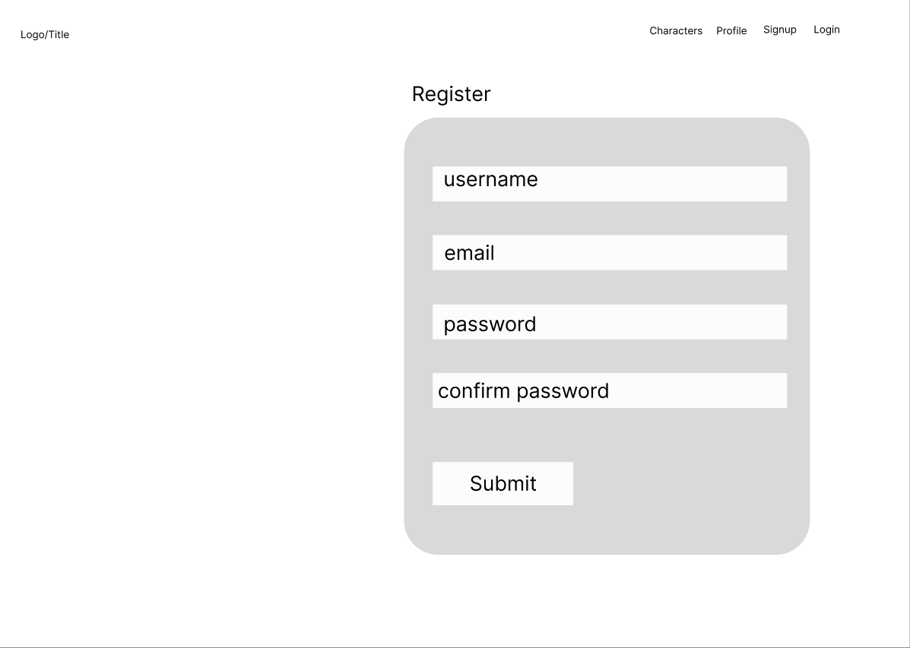
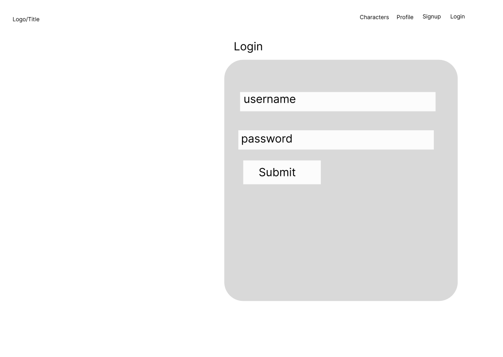

# SFLabAssistant

 "Street Fighter Lab Assistant" is a full-stack app that serves as a resource for Street Fighter players, allowing them to track and enhance their training by accessing character information, movelists, user-submitted videos, and personalized notes.

 # User Stories

Users will be able to:

1. Create an account to track the characters they play and start training notes and video libraries for those characters.
2. View all 18 characters and their moves list.
3. View a video library of user submitted youtube links on each character's profile.
4. Set characters as 'mains' or 'alts' that adds them to their individual 'user roster'.
5. Add comments in a 'Study' area for the characters in the roster to track what they would like to train on for that character.
6. Add videos from the character's video library to their own individual video library to track what videos they want to save as reference for their training.
7. Add moves from a character's moves list to a user's 'move drills' section for that character to track what moves they would like to train.
 
 Stretch Goals:
    1. Character profiles will have a section to rate matchups by difficulty.
    2. Character profiles will have clickable button symbols for users to make and catalog their own combos.
    3. Add pre-made ‘masteries’ to check off for each character. 

# Models

| **API Route**                       	| **Request Method** 	| **Body**                                              	| **Response**                                                              	|
|-------------------------------------	|--------------------	|-------------------------------------------------------	|---------------------------------------------------------------------------	|
| /signup                             	| POST               	| {name, email, password}                               	| {id, name, email, password}                                               	|
| /login                              	| POST               	| {email, password}                                     	| {{"message":"login successful"}, "user": {id, name, email}}               	|
| /logout                             	| DELETE             	|                                                       	| {"message" : "logout successful"}                                         	|
| /characters                         	| GET                	|                                                       	| {id, name, img_url}                                                       	|
| /characters/<string:name>           	| GET                	|                                                       	| {id, name, img_url}                                                       	|
| /characters/<string:name>/moves     	| GET                	|                                                       	| {id, character_id, name, command}                                         	|
| /characters/<string:name>/videos    	| GET                	|                                                       	| {id, character_id, user_id, title, description, youtube_link, created_at} 	|
| /characters/<string:name>/videos/id 	| GET                	|                                                       	| {id, character_id, user_id, title, description, youtube_link, created_at} 	|
| /characters/<string:name>/videos    	| DELETE             	|                                                       	| {"message" : "Video deleted"}                                             	|
| /characters/<string:name>/comments  	| POST               	| {id, user_id, character_id, content}                  	| {id, user_id, character_id, content}                                      	|
| /characters/<string:name>/comments  	| PATCH              	| {id, user_id, character_id, content}                  	| {id, user_id, character_id, content}                                      	|
| /characters/<string:name>/comments  	| DELETE             	|                                                       	| {"message" : "Comment deleted"}                                           	|
| /users/<string:username>/roster     	| GET                	|                                                       	|                                                                           	|
| /users/<string:username>/roster/id  	| PATCH              	| {id, user_id, character_id, content, is_main, is_alt} 	| {id, user_id, character_id, content, is_main, is_alt}                     	|
| /users/<string:username>/roster/id  	| DELETE             	|                                                       	| {"message" : "Character deleted from roster"}                             	|

# React Tree

# Client Routes
| Client Routes    | Component     |   |   |   |
|------------------|---------------|---|---|---|
| /                | Home.jsx      |   |   |   |
| /characters/name | Character.jsx |   |   |   |
| /login           | Login.jsx     |   |   |   |
| /signup          | Signup.jsx    |   |   |   |
| /user            | User.jsx      |   |   |   |

# Wireframes

